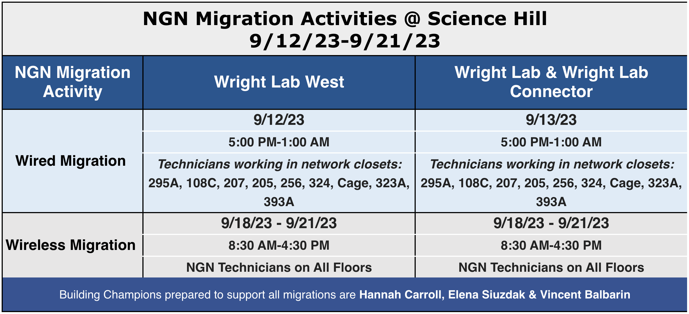
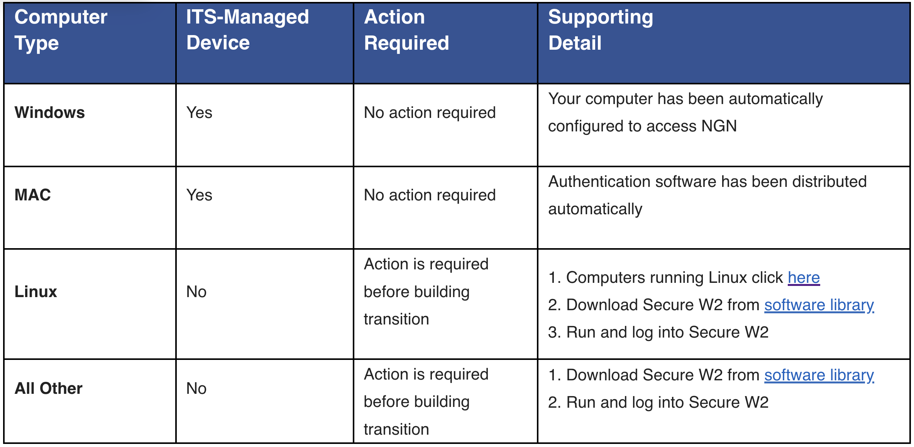

# **Wright Lab Yale Next-Generation-Network Migration**

Vincent Balbarin
11 September 2023

---
<!-- paginate: true -->

## Key Benefits

1. Improved security on private networks
2. Higher throughput between buildings
3. File transfer rates that approach file transfer rates of ScienceNet
4. Easier guest access to the internet without the need to provision a sponsored NetID

---

## User Impact

1. Users and computers will need to be authenticated
2. Non-managed devices will need the secureW2 application to access the wireless network
3. Linux wired connections will need to be configured for authentication
4. Devices that do not allow configuration of a network connection such as IoT devices will need to have their MAC addresses registered.
5. All devices will receive a new random IP address in the 10.x.x.x range
6. Devices may reserve an IP address; however, they should be accessed through DNS
7. Devices that need to be accessed by the outside world will require special routes

---

## Migration Activities

---

1. Wired migration 5:00 pm-1:00 am, 12-13 September 2023
2. Public safety migration 9 am-5:00 pm, 14 September 2023
3. Wireless migration 8:30 am-4:30 pm, 18-21 September 2023

---

## User Actions

---

1. Download [**secureW2**](https://yale.onthehub.com/WebStore/OfferingDetails.aspx?o=4a21cb07-1f0c-ec11-813e-000d3af41938) application from the [Yale Software Library](https://yale.onthehub.com/WebStore/Welcome.aspx) on the day prior to migration.
2. Install and run **secureW2** application. The documentation can be found at [KB0024635](https://yale.service-now.com/it?id=support_article&sys_id=c13426d61b850010f61dfeeccd4bcbad)
3. Configure Linx wired connection for authentication [KB0024749](https://yale.service-now.com/it?id=support_article&sys_id=3c1548ba1b960810f5c70f22dd4bcb2e)
4. Update remote access client settings by using the fully qualified domain name of server instead of IP address.

---

## Getting Help

1. NGN Technicians will be on site during the specified times to help asses immediate issues
2. The distributed support provide and I can help with filing an issue with the ITS Help Desk at 2-9000.