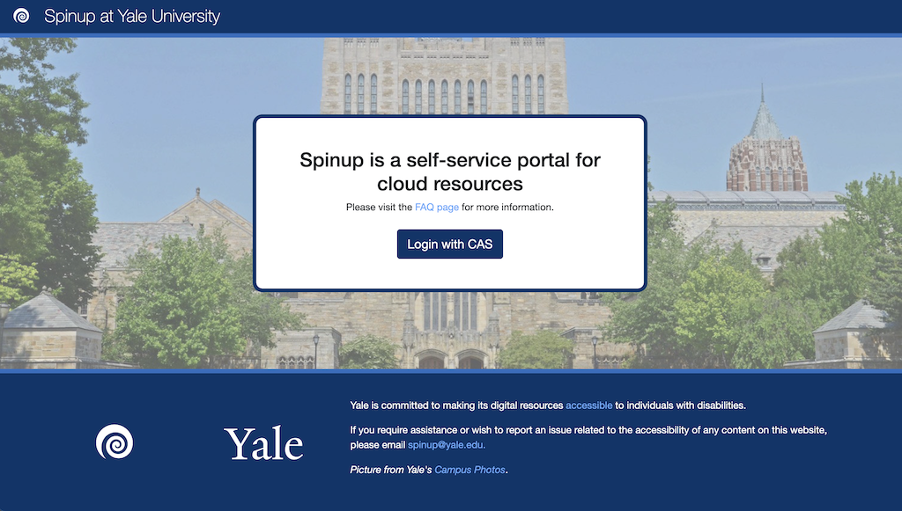

# **Introduction to Yale Spinup and Cloud Computing**
Vincent Balbarin
September 27, 2022

---
<!-- paginate: true -->

## Key Traits of Cloud Computing

* Self-provisioning
* Shared
* Elastic/Ephemeral
* Accessible
* Metered

<!-- 

notes:
* How are the traits different from previous computing paradigms?
* How is this any different from

-->

---

## Implementation

* Identity and role-based access controls
* Policy
* Automated provisioning and configurationof workloads
* Wide area networks
* Service instrumentation

<!-- 

## notes:
* How does one implement this?
* How is this different from logging into Meitner?
* Declarative, not procedural

-->

----

## How can we do it?

---

## Yale Spinup

* Application layer over a shared AWS account
* Yale governance

---

## Identity and Access

* CAS/Shibboleth identity provider
* This identity is set as the owner of Spaces and Teams
* Space manages resources
* Team manages authorized spinup users
* NB, at the service level only creator-owners have privileges, IE a Team member has the rights to create and delete servers. That person must explicity grant (useradd) at resource level.

---

## Resource

* Deployed to closest region (US East 1/N. Virginia)
* Preconfigured resource types 
* Spaces
  * Logical grouping of resources
  * Access and cost boundary
* Charge-back and cost management

---

## Demonstration

<!-- 

## notes:

1. The portal can be reached from campus or VPN IP addresses
2. CAS
3. User home
   a. Create Space
   b. Create a Team
4. New space
5. Overview of resources

-->

---

## Infrastructure as a Service (IaaS): Server Instances

* Virtual servers hosted in Amazon EC2
* Cost directly proportional to provisioned resource
* Only charged for uptime and storage
* Regular snapshots

---

## Demonstration: Spinup EC2 Instances

<!-- 

## notes:

1. Select image, tryit
2. Launch
3. Show ssh
4. Remind folks that only createor is root; must add others
5. Best practice add another key
6. Cost, delete or shutoff instances

-->

---

## Platform as a Service (PaaS): Databases

* Provisioned to clustered database environment or to a fully managed instance
* Backups fully managed
* No need for patching
* Support for common databases

---

## Storage

* S3 object storage
* NFS volumes through Amazon Elastic File System (EFS)
* Static websites

<!--

## notes:

1. Talk about durability and availability; data can be spread across a region/regions
2. Access via https
3. NB, access keys should be cycled.
3. Pay only for what you use
3. Current cost for S3 12 USD/(500 GB * 30 days); for glacier 2 USD(500 GB * 30 days)
3. NFS endpoints are available only to the space
4. Storage grows and shrinks
5. Policy to move less accessed data to cooler (less pricy storage)

-->

---

## Containers

* Containers such as docker isolate the application runtime from the underlying OS
* Achieve greater densitity and utilization
* Drawbacks
  * Complicated infrastructure
  * Orchestration of interrelated services

<!-- 

notes:

1. Docker and podman allow you to package up the runtime environment (OS components and application components).
2. Each container is specific to a component--ie, database, middle tier, application.
3. Docker swarm lets you run on local system or instance--you have to maintain host
4. Kubernetes is a complete solution that provides control plane for scalout of instances and takes care of orchestration and communication between components.

-->
---

## Spinup Container Services

---

## Networking

